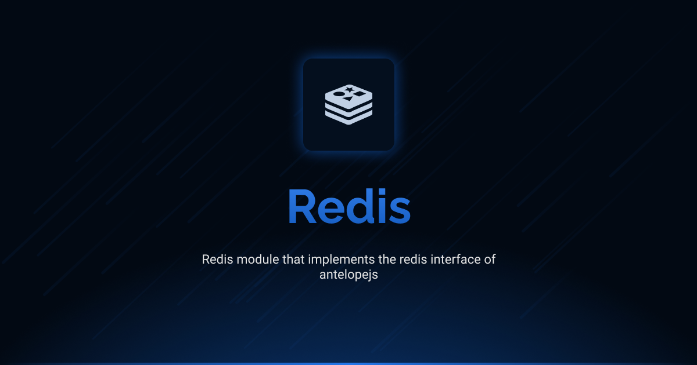

# @antelopejs/redis

<div align="center">
<a href="https://www.npmjs.com/package/@antelopejs/redis"></a>
<a href="./LICENSE"></a>
<a href="https://discord.gg/sjK28QHrA7"></a>
<a href="https://antelopejs.com/modules/redis"></a>
</div>

A Redis client module that implements the Redis and Redis Scheduler interfaces for AntelopeJS.

## Installation

```bash
ajs project modules add @antelopejs/redis
```

## Interfaces

This module implements two key interfaces:

- **Redis Interface**: Promise-based Redis client with key-value operations and pub/sub messaging.
- **Redis Scheduler Interface**: Redis-based distributed task scheduler with job queuing and automatic retries.

Both interfaces can be used independently or together depending on your application's needs. The interfaces are installed separately to maintain modularity and minimize dependencies.

| Name            | Install command                          |                                                                          |
| --------------- | ---------------------------------------- | ------------------------------------------------------------------------ |
| Redis           | `ajs module imports add redis`           | [Documentation](https://github.com/AntelopeJS/interface-redis)           |
| Redis Scheduler | `ajs module imports add redis_scheduler` | [Documentation](https://github.com/AntelopeJS/interface-redis-scheduler) |

## Overview

The AntelopeJS Redis module provides functionality for interacting with Redis:

- Redis client connection management
- Task scheduling with retry capabilities

## Configuration

The Redis module can be configured with standard Redis client options:

```json
{
  "url": "redis://localhost:6379",
  "socket": {
    "reconnectStrategy": true
  }
}
```

### Configuration Details

The module accepts the following configuration properties:

- All standard Redis client options from the `redis` package
- Supports all connection methods including URL string, socket options, etc.

## Integration with Other Modules

The Redis module is designed to be used as a dependency for other AntelopeJS modules:

```typescript
// Example of another module depending on Redis
import { GetClient } from '@ajs/redis/beta';

async function storeValueInRedis(key: string, value: string) {
  const client = await GetClient();
  await client.set(key, value);
}
```

## License

This project is licensed under the Apache License 2.0 - see the [LICENSE](LICENSE) file for details.
